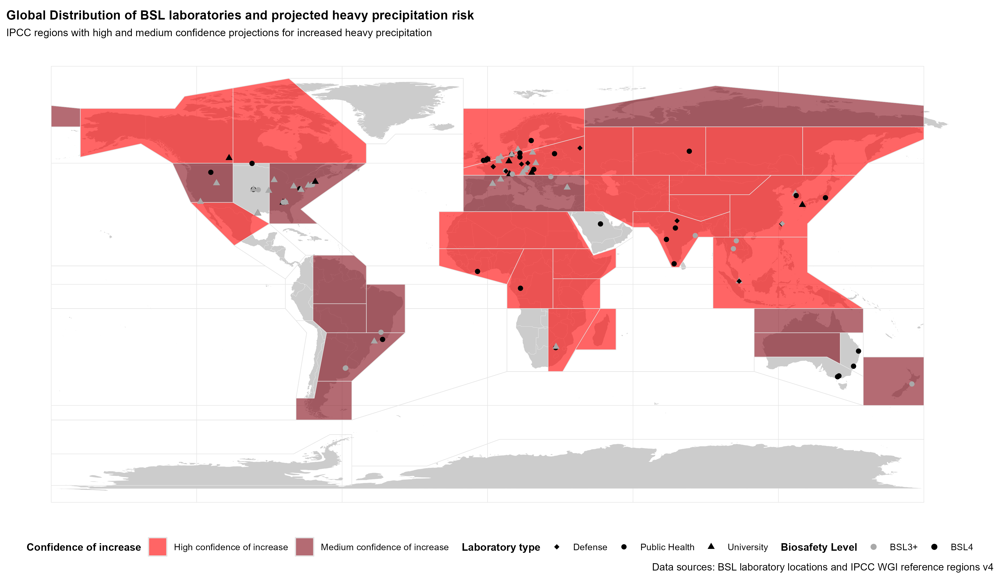

# 🌍 Global BSL labs and climate risks  
Mapping the distribution of high-containment laboratories and projected climate-related hazards

## 🔍 Overview  
Visualize the global distribution of **Biosafety Level 3+ (BSL3+)** and **BSL4** laboratories alongside IPCC-projected climate risks (e.g., floods, cyclones, sea-level rise). *Where are high-containment labs located, and how might climate change impact their operational risks?*  

## 📊 Key Outputs  
1. **Static Maps**:  
   - Seven maps (e.g., river floods, tropical cyclones) showing labs overlaid on IPCC risk regions.  
   - Example:
       

2. **Interactive Map**:  
   - Explore labs and toggle climate risks [here](outputs/map.html).  

## 🛠️ How It Works  
- **Data**: IPCC-projected climate risks + lab locations, all compiled from publicly-available information
- **Tools**: `R` (sf, leaflet), RMarkdown 

🤝 Contribute
Found an error or want to expand? Open an issue or PR.
